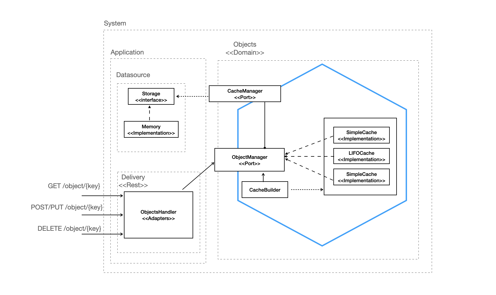

# cache

[](https://codecov.io/gh/cristianchaparroa/cache)

This repository follows the hexagonal architecture, the below diagram shows an overview of it.



## Local development environment

### Requirements

You should have installed Go in your machine, please follow this guide https://golang.org/doc/install

### Download the project

```shell script
git clone https://github.com/cristianchaparroa/cache.git 
```
### Execute the application

You can run the server using the following command

```shell script
cd path/to/project/cache/
go run *.go
``` 

After executes the last commands, you can start to using the API. 

### Docker

If is not possible create a local environment, and you have docker installed in
your machine you can follow the next steps to run the application.

```shell script
cd path/to/project/cache/
docker build -t cache .
docker run -p 8080:8080 cache
```


### Docker-compose

If you have installed `docker` and `docker-compose` you also can deploy the services just with

```shell script
cd path/to/project/cache/
docker-compose up
```
It'll start the API server that will be expose in
```
{host}:8080
```

## Testing

### Unit testing

You can run the unit testing using
```shell script
go test ./... 
```


## Usage

1. Create an object in memory
```shell
curl --request POST \
--url http://localhost:8080/object/1 \
--header 'Content-Type: application/json' \
--data '{
"name": "cristian",
"last": "chaparro",
"country": "Colombia",
"phone": "3226638130"
}'
```

2. Get an object by key
```shell
curl --request GET \
--url http://localhost:8080/object/1
```

3. Update an existent object

```shell
curl --request PUT \
  --url http://localhost:8080/object/1 \
  --header 'Content-Type: application/json' \
  --data '{
	"name": "cristian",
	"last": "chaparro",
	"country": "Colombia",
	"phone": "3226638130",
	"another": "field"
}'
```

4. Delete an object

```shell
curl --request DELETE \
  --url http://localhost:8080/object/1
```